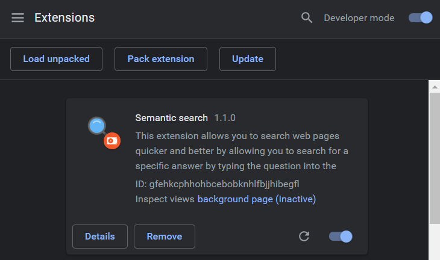
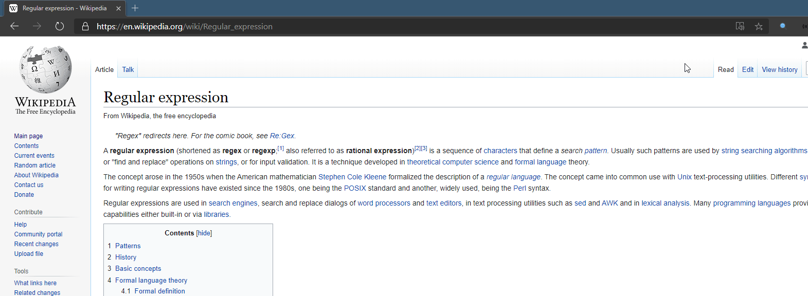
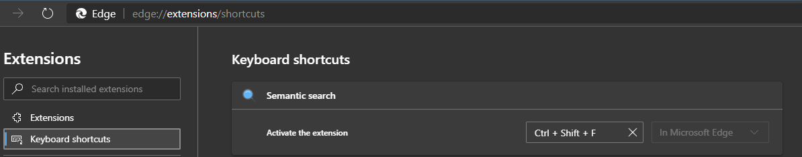

# SemanticSearch

🔹Info
---
This project creates a Chrome extension, enabling users to semantically search
within a web page content. The extension uses <a href="https://huggingface.co/transformers/" target="_blank">🤗 Transformers</a> to create the deep learning model and <a href="https://www.tensorflow.org/js" target="_blank">TensorflowJS</a>  library 

To build the extension, use the command:

```sh
npm install
npx webpack
```

To install the unpacked extension in chrome, follow the [instructions here](https://developer.chrome.com/extensions/getstarted).  Briefly, navigate to `chrome://extensions` or `edge://extensions`, make sure that the `Developer mode` switch is turned on in the upper right, and click `Load Unpacked`.  Then select the appropriate directory (the `dist` directory containing `manifest.json`);

If it worked you should see an icon for the `SemanticSearch` Chrome extension.



🔹Using the extension
----
Once the extension is installed, you should be able to search the webpage by pressing the SemanticSearch icon or via shortcut `CTRL+SHIFT+F`.  

#### ⚠Note
if the shortcut doesn't work, open `Keyboard shortcuts` and `activate the extension` by the mentioned shortcut


🔹Removing the extension
----
To remove the extension, click `Remove` on the extension page, or use the `Remove from Chrome...` menu option when right clicking the icon.
